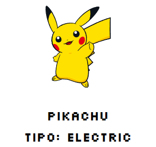

<p align="center"></p>

<div align="center">
	<h3 align="center">Pokedex</h3>
	<p align="center">Projeto de uma página responsiva de uma Pokedex, onde o usuário poderá pesquisar o nome do pokemon e será retornado para ele o valor exato no qual foi pesquisado ou o mais próximo possivel.</p>
</div>
<h3  align="center">
		✅ Status: concluído ✅
</h3>
<div align="center">
<a href="#">Acesse a aplicação clicando aqui !</a>
</div>

## 🗒️ Conteúdo

- [Sobre](#-Sobre)
- [Demonstração](#-Demonstração)
- [Tecnologias](#-tecnologias)
- [Pré-requisitos](#-Pré-requisitos)
- [Como rodar?](#-Rodando-a-aplicação)
- [Autor](#-Autor)

## 📖 Sobre
Projeto desenvolvido através de idéias e estudos feitos pessoalmente. Um projeto que consiste em uma Pokedex consumindo uma API de pokemons, o projeto é totalmente responsivo e utilizado apenas com HTML, CSS & JavaScript.

## 📺 Demonstração

<p align="center">
  
</p>

## 🛠 Tecnologias

As seguintes ferramentas foram usadas na construção do projeto:

- [HTML](https://developer.mozilla.org/pt-BR/docs/Web/HTML)
- [CSS](https://developer.mozilla.org/pt-BR/docs/Web/CSS)
  - [Display Flex](https://developer.mozilla.org/en-US/docs/Learn/CSS/CSS_layout/Flexbox)
- [Javascript](https://developer.mozilla.org/pt-BR/docs/Web/JavaScript)

## ⚠️ Pré-requisitos

Antes de começar, você vai precisar ter instalado em sua máquina as seguintes ferramentas:

- [VSCode](https://code.visualstudio.com/)
- [Git](https://git-scm.com)
- [NPM](https://www.npmjs.com)


## 🔥 Rodando a aplicação

```bash
# Baixe este repositório

# Acesse a pasta do projeto no vscode:

# Execute o arquivo index.html com o LiveServer pelo vscode
# ou abra o arquivo index.html no seu navegador

# A aplicação iniciará localmente na sua maquina !
```

<!-- AUTOR -->

## 🤓 Autor

<div align="center" >
<a href="https://www.linkedin.com/in/leonisantos/">
 
 <br />
 <b>Leôni Santos</b></a> <a href="https://www.linkedin.com/in/leonisantos/" title="Linkedin">🚀
</a>
 <br />
 <br />
Feito com ❤️ por Leôni Santos 👋🏽 Entre em contato!

</div>

## 📕License

This project is under the [MIT](./LICENSE).
